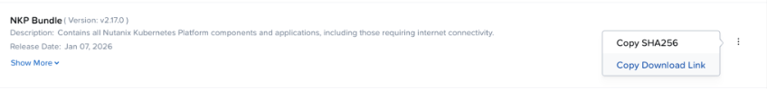
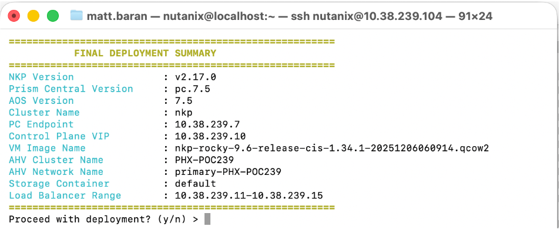

# Nutanix Kubernetes Platform (NKP) Automated Deployment


An interactive, end-to-end Bash utility and technical walkthrough designed to streamline the provisioning of Nutanix Kubernetes Platform (NKP) clusters. This deployment uses a dedicated Bastion Host (Rocky Linux Minimal VM) and handles everything from configuring system-level prerequisites to executing the final cluster creation.

## 🌟 Key Features

- **Automated System Preparation:** Checks for and configures system-wide cgroup v2 delegation (requires `sudo`), prompting for a system reboot only if necessary.
- **Smart Bundle Management:** Prompts for a Nutanix portal download URL, seamlessly fetching and extracting the contents on the fly.
- **Binary Auto-Installation:** Automatically extracts and installs essential binaries (`nkp` and `kubectl`) directly into `/usr/local/bin`.
- **API Version Validation:** Interfaces with the Prism Central API to ensure that both Prism Central and AOS versions are running version `> 7.3` before allowing deployment to proceed.
- **Interactive & Secure:** Provides a color-coded CLI experience, safely masks password inputs, and displays a pre-flight summary table that requires manual user confirmation.

---

## 🛠️ Prerequisites

The following materials, network configurations, and accounts are required before starting the deployment:

### 1. Environment & Networking
- The target cluster must be running **AOS 7.3** or newer and **Prism Central (PC) 7.3** or newer.
- **DHCP/IPAM** is required.
- **IP Addresses** (must all exist in the same or reachable subnet as the Bastion Host):
  - 1x Control Plane VIP (outside of IPAM scope)
  - 5-10 Load Balancer IPs / Range (outside of IPAM scope)

### 2. Nutanix Support Portal Downloads
- **NKP Bundle:** Copy the download link for the NKP Bundle and save the URL for use during the script execution.
  
- **NKP Node OS Image:** Download the Rocky 9.6 NKP Node OS Image (`nkp-rocky-9.6-release-cis-1.34.1-20251206060914.qcow2`).

### 3. Rocky Linux Download
- **Bastion Image:** Download the Rocky 9.7 Cloud Image (`Rocky-9-GenericCloud-Base.latest.x86_64.qcow2`).

### 4. Prism Central Image Upload
Upload the downloaded images to Prism Central via **Infrastructure > Images**:
1. Rocky 9.6 NKP Node OS Image (Used for cluster nodes)
2. Rocky 9.7 Cloud Image (Used for the Bastion Host)

---

## 🖥️ Getting Started: Bastion Host Creation

Before starting the OS installation, you must define the VM resources within your Nutanix cluster.

1. Log in to Nutanix Prism (Central or Element).
2. Navigate to **VM > Create VM**.
3. **General Configuration:**
   - **Name:** `Bastion-Host-Rocky9`
   - **vCPU:** `4`
   - **Memory:** `8 GiB`
4. **Disks:**
   - Attach Disk: Choose **Clone from Image** and select `Rocky-9-GenericCloud-Base.latest.x86_64.qcow2`.
   - Size: `100GB`
5. **Network:** Add a NIC attached to your desired Management VLAN.
6. **Guest Customization:** Select **Cloud-Init (Linux)** and paste the contents from this repos `cloud-init` file.
7. Save the configuration and **Power On** the VM.
8. The system will power on and display a banner indicating that it’s still provisioning. Wait for the reboot to occur and the banner to clear.
9. Once the VM has rebooted, find the IP address of your new bastion host and connect via SSH:
   ```bash
   ssh nutanix@<BASTIONIP>
   ```

---

## 🚀 NKP Cluster Deployment

Once inside the Bastion Host, use the following helper script to guide you through the deployment variables interactively.

### 1. Download and execute the script
```bash
# Download helper script and make executable
curl -L https://raw.githubusercontent.com/mbaran5/nkpdeploy/main/nkpDeploy.sh -o nkpDeploy.sh
chmod +x nkpDeploy.sh

# Execute nkpDeploy and fill in all responses as requested
./nkpDeploy.sh
```

### 2. Confirm the Pre-Flight Summary
The script will ask for your cluster details, credentials, and image names. Review and confirm the details in the final summary table to kick off the cluster build.



---

## 🏁 Post-Deployment

The deployment process typically takes around 45 minutes. Once the script finishes, use the following commands to get your dashboard URL and login information:

```bash
# Ensure your kubeconfig is set contextually
export KUBECONFIG=./${CLUSTER_NAME}.conf

# Retrieve the dashboard URL and login credentials
nkp get dashboard
```

---

## ⚙️ Environment Variables Reference

For convenience and seamless execution, the deployment script automatically sets and exports the following environment variables required by the `nkp` binary during runtime:

- `NUTANIX_USER`: Your Prism Central username.
- `NUTANIX_PASSWORD`: Your Prism Central password.
- `NUTANIX_ENDPOINT`: The Prism Central API endpoint.
- `KUBECONFIG`: Sets the context to the newly created cluster's config file (generated in your current working directory).
