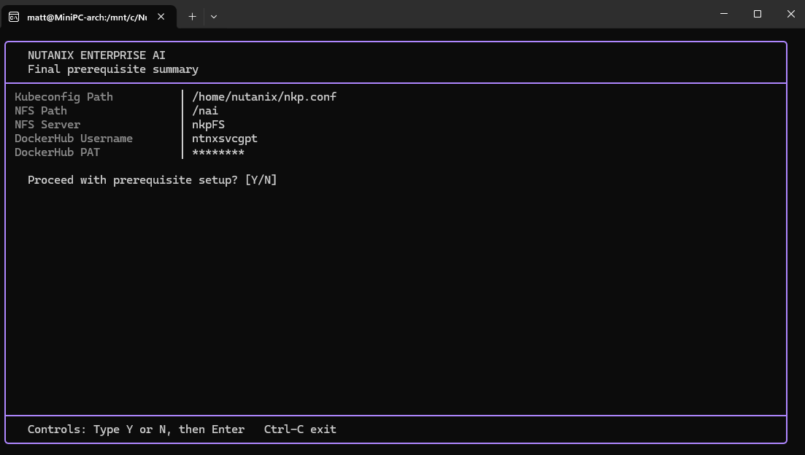

# Nutanix Enterprise AI (NAI) Deployment Walkthrough


This document provides a technical walkthrough for deploying **Nutanix Enterprise AI (NAI)** on top of the Nutanix Kubernetes Platform (NKP). It covers hardware sizing, prerequisite applications, and the baseline cluster configuration required before initiating the deployment through the NKP Application Catalog.

---

## 📋 Prerequisites

Before beginning the deployment, ensure your environment meets the following hardware, storage, and software requirements:

### 1. Hardware Requirements
* **vCPU:** Worker nodes must have a minimum of **24 vCPU** to run the Gemma 2b model.
* **CPU Architecture:** **AVX-512** instruction set support is strictly required to run any Llama 3.2 model (Intel Sapphire Rapids or newer).

### 2. Storage Requirements
* **NFS storage:** An NFS export must be available, active, and reachable by the worker nodes. Nutanix Files is not specifically required.

### 3. Required NKP Applications
Ensure the following applications are marked as **"Enabled"** within your target NKP cluster/workspace:
* `cert-manager`
* `envoy-gateway`
* `prometheus` (Prometheus Monitoring)
* `nvidia-gpu-operator`
* `kserve`
* `opentelemetry-operator`

### 4. Authentication
* **Docker Credentials:** You must have access to the Nutanix Support Portal to retrieve your NAI Docker credentials/PAT (Personal Access Token). These are found under *Downloads > Nutanix Enterprise AI*.

---

## ⚙️ Pre-Deployment Configuration

Before installing NAI from the application catalog, the cluster needs a storage class backed by the available NFS export, two namespaces, and registry secrets.

Use the provided Bash script to enter the kubeconfig path, NFS server/export details, and DockerHub credentials. The script temporarily exports the kubeconfig, discovers all NKP workspaces, and lets you select the target workspace with the keyboard. It also displays the workspace and cluster applications, then identifies the prerequisites required by `nutanix-ai-2.8.0`.



The final review screen confirms the selected workspace and targeted prerequisite applications before anything is applied. No resources or applications are installed until you answer `Y`. The DockerHub PAT is masked while it is entered and displayed.

```bash
# Download helper script and make it executable
curl -L https://raw.githubusercontent.com/mbaran5/nkpdeploy/refs/heads/main/nai/preDeploy.sh -o naiDeploy.sh
chmod +x naiDeploy.sh

# Execute the script and fill in the prompts
./naiDeploy.sh
```

## 🚀 Installation

Once the prerequisite configurations (StorageClass, namespaces, and registry secrets) are successfully applied to your cluster, proceed with the UI installation.

1. Log into your **NKP Dashboard**.
2. Navigate to the **NKP Application Catalog**.
3. Locate and select the **Nutanix Enterprise AI** application.
4. During the configuration phase, you **must** specify the following YAML override to ensure the pods can pull the proprietary images:

```yaml
global:
  imagePullSecrets:
    - name: nai-regcred
```

5. Deploy the application and monitor the pods in the `nai-system` namespace until they reach a `Running` state.
